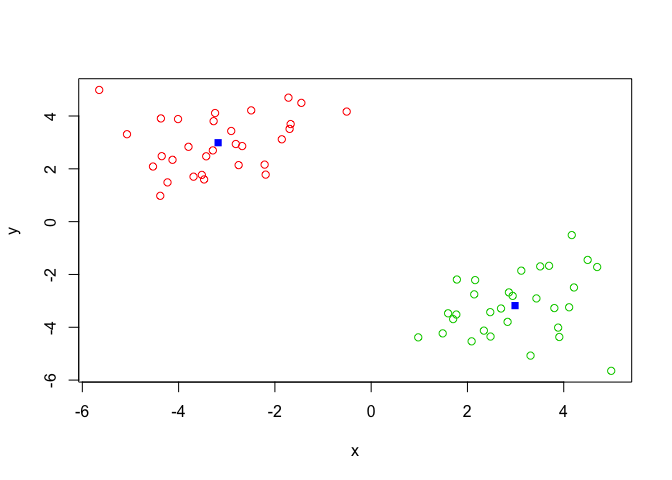

Lecture\_9
================
Alex Weitzel
2/4/2020

K-means clustering algorithms

111-11—111——1111 pick a k k = 3

k looks at the variation within clusters.

it looks to me like the order in which something iterates over values in
a k-mean will change the grouping structure…

you can pick the number of clusters with a Scree plot. plotting the
number of clusters (x) against the Total variation within clusters “sum
of squares, SS” (y). There’s a point known as the ‘elbow’ (it’s the top
of the scree pile) in which you have larest decrease in SS.

``` r
tmp <- c(rnorm(30,-3), rnorm(30,3))
x <- cbind(x = tmp, y = rev(tmp))

plot(x)
```

<!-- -->

``` r
this <- kmeans(x, centers = 2)

plot(x, col = (this$cluster+1))
points(this$centers, col = "blue", pch = 15)
```

<!-- -->

Hierarchical clustering Number of clusters is not known ahead of time
two kinds bottom-up top-down

The main hierarchical clustering function in R is called hclust() An
important point here is that you have to calcualate the distance matrix
deom your input data before calling hclust())

make sure to do “complete”, “average”, and “single”

``` r
dist_matrix <- dist(x)

hc <- hclust(d = dist_matrix)

hc
```

    ## 
    ## Call:
    ## hclust(d = dist_matrix)
    ## 
    ## Cluster method   : complete 
    ## Distance         : euclidean 
    ## Number of objects: 60

``` r
plot(hc)

abline(h=max(hc$height), col="red", lty=2)
```

<!-- -->

``` r
plot(x, col = cutree(hc, k = 4))
```

<!-- -->

``` r
grps <- cutree(hc, k = 3)
table(grps)
```

    ## grps
    ##  1  2  3 
    ## 30 12 18

``` r
uk_data <- read.csv("Data/UK_foods.csv", row.names = 1)
uk_data
```

    ##                     England Wales Scotland N.Ireland
    ## Cheese                  105   103      103        66
    ## Carcass_meat            245   227      242       267
    ## Other_meat              685   803      750       586
    ## Fish                    147   160      122        93
    ## Fats_and_oils           193   235      184       209
    ## Sugars                  156   175      147       139
    ## Fresh_potatoes          720   874      566      1033
    ## Fresh_Veg               253   265      171       143
    ## Other_Veg               488   570      418       355
    ## Processed_potatoes      198   203      220       187
    ## Processed_Veg           360   365      337       334
    ## Fresh_fruit            1102  1137      957       674
    ## Cereals                1472  1582     1462      1494
    ## Beverages                57    73       53        47
    ## Soft_drinks            1374  1256     1572      1506
    ## Alcoholic_drinks        375   475      458       135
    ## Confectionery            54    64       62        41

``` r
dim(uk_data)
```

    ## [1] 17  4

``` r
pairs(uk_data, col=rainbow(10), pch=16)
```

<!-- -->

``` r
pca <- prcomp(t(uk_data))
summary(pca)
```

    ## Importance of components:
    ##                             PC1      PC2      PC3       PC4
    ## Standard deviation     324.1502 212.7478 73.87622 4.189e-14
    ## Proportion of Variance   0.6744   0.2905  0.03503 0.000e+00
    ## Cumulative Proportion    0.6744   0.9650  1.00000 1.000e+00

``` r
plot(pca$x[,"PC1"], pca$x[,"PC2"], xlab="PC1", ylab="PC2", xlim=c(-270,500))
text(pca$x[,1], pca$x[,2], colnames(uk_data))
```

<!-- -->

``` r
attributes(pca)
```

    ## $names
    ## [1] "sdev"     "rotation" "center"   "scale"    "x"       
    ## 
    ## $class
    ## [1] "prcomp"
